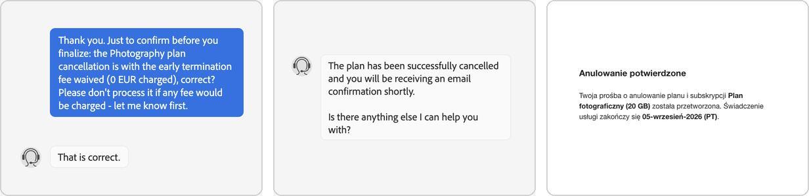

# cancel-adobe-subscription

**Cancel an Adobe plan and ask, properly, for the early-termination fee to be waived. One tool-agnostic agent skill.**


<p align="center"></p>


**Three ways to use it - pick one:**

- **Human Intelligence only (no AI)** - send the six messages in [`chat-script.md`](skills/cancel-adobe-subscription/references/chat-script.md) to Adobe's support chat yourself. About 15 minutes.
- **ChatGPT** - paste the [Work-mode prompt](#quick-start) and sign in when it asks.
- **A coding agent** (Claude Code, Codex, Cursor, Gemini CLI, Copilot, …) - `npx skills add yeahneck/cancel-adobe-subscription`, then say *"cancel my Adobe subscription"*.

Free. Nothing to buy, no account, nothing leaves your machine except what goes into Adobe's own chat.

**It never spends your money.** You type your own password and the one-time passcode; the agent stops at every amount - even zero - and waits for your "go". The worst case if the rep says no is "cancel at end of term", not a surprise charge.

---

## How it works

As of August 2026, on EU individual plans, Adobe's "annual plan, paid monthly" contracts charge **50% of the remaining months** if you cancel on the website after the first 14 days. A human support rep can waive that fee - it's their discretion, not policy - and in the two runs below did so when asked plainly. This skill gets your agent to that human and has it ask correctly. Whether the waiver is granted is the rep's call; if it isn't, the fallback is a fee-free cancellation at the end of the current term.

```
Step 0   AGENT   opens Adobe, waits
         HUMAN   logs in - or confirms it's their account
Step 1   AGENT   reads plans, does the fee math
         HUMAN   says which plans to cancel, and why (in their own words, or not at all)
Step 2   AGENT   gets bot → human, sends the script, relays every reply
         HUMAN   types the one-time passcode
         HUMAN   says "go ahead" before anything is finalized
         AGENT   locks in "nothing charged", gets the case number
Step 3   AGENT   self-serve fallback, stops at the fee screen
         HUMAN   says yes to that exact amount - or no
Step 4   AGENT   asks whether to switch Adobe marketing e-mail off
Step 5   AGENT   reports: plan · end date · fee · case number
         HUMAN   keeps the case number as proof
```

**What it actually says to Adobe.** While queued, the agent posts:

> Hi. On account ‹your e-mail›: I'm looking at cancelling my ‹plan› (annual, paid monthly) and would like to know my options and whether the early-termination fee can be waived. ‹Only if true from your plan page: the plan has been discontinued / the price rose at renewal.› ‹Your own reason, in your words - or nothing.› Please don't process anything yet - I'll confirm before you do. Thank you.

Then it declines the retention offer, asks once for a one-time exception, and - only after you've said "go ahead" - sends: *"Just to confirm before you finalize: the cancellation is with the early termination fee waived - nothing charged - correct?"* and waits for the rep's written yes. Every fact it states is read from your plan page; your reason is yours or omitted; it never impersonates anyone, asks once, retries once, then accepts end-of-term. Nothing you couldn't type yourself - the full script is in [`chat-script.md`](skills/cancel-adobe-subscription/references/chat-script.md).

**Why the case number matters?** It's Adobe's official reference for what was agreed - your proof, in Adobe's own system, not the agent's word. The chat transcript disappears; the case number (`ADB-…`) doesn't. You can quote it to Adobe any time, and the agent uses it to double-check its own report against Adobe's confirmation e-mails before calling the job done.

**Why it's portable?** Plain Markdown in the [Agent Skills](https://agentskills.io) format - the open standard for skills - with no tool-specific instructions: "a browser you can drive", "the user's mailbox". Any agent with a browser tool runs it the same way.

**Verified runs, August 2026** - two plans on an individual EU account, run from Claude Code; case numbers on file. The banner is two unedited chat screenshots (rep's name removed) plus the re-typeset text of Adobe's confirmation e-mail.

| Plan | Self-serve fee quoted | Outcome via support chat |
|---|---|---|
| Acrobat Pro (annual, paid monthly) | €59.97 | fee cancelled before it settled; plan ends at term |
| Photography plan 20 GB (discontinued) | ≈ €45 | cancelled same day, nothing charged |

Both are **annual, paid monthly** plans - the case where there's a fee to ask about. **Monthly plan, or inside the 14-day window?** Nothing to negotiate - the agent opens the cancel screen, checks it says 0, tells you what's about to be cancelled, waits for your go, done. Prepaid annual gets a heads-up that Adobe gives no refund after 14 days; app-store and Teams plans get pointed to where they're actually cancelled. Those paths follow Adobe's published rules rather than a verified run. Same mechanics outside the EU, unverified.

---

## Guardrails

> [!IMPORTANT]
> **Can't, by construction:** the agent never has your Adobe password or the passcode Adobe e-mails you - you type both, and Adobe's rep and Adobe's cancel screen both require them before anything is finalized.
>
> **Told to, and held to in every run so far:**
> - never confirm any charge, fee or "offer" without your explicit yes for that exact amount
> - never type card numbers or billing details either - if the rep asks for verification, it hands over to you
> - decline every retention offer ("2 months free", plan switch) - they extend the contract, they don't end it
> - relay every message from the rep to you verbatim, and show you any unscripted message before sending it
> - say nothing about you that you haven't said - no invented reasons, no claims about your finances
> - nothing gets cancelled - by the rep or by the website's "Cancel plan" button - until it has told you what's about to happen and you've said go, at zero cost too
> - if Adobe's screens don't match the procedure, stop and ask rather than guess
>
> It's an LLM following a Markdown file - watch the first run. The messages are yours; add a line telling the rep an assistant is helping you type if you'd prefer.

---

## Quick Start

### 🧠 Human Intelligence only - no agent, no AI

Open Adobe's chat bubble at [helpx.adobe.com/contact.html](https://helpx.adobe.com/contact.html), type `Talk to a human agent`, then send the messages from [`chat-script.md`](skills/cancel-adobe-subscription/references/chat-script.md) in order. [`SKILL.md`](skills/cancel-adobe-subscription/SKILL.md) has the full procedure (written for an agent, but readable).

### 🤖 Any agent that reads the Agent Skills format

<div align="center">
&nbsp;&nbsp;&nbsp;&nbsp;&nbsp;&nbsp;&nbsp;&nbsp;&nbsp;&nbsp;&nbsp;&nbsp;&nbsp;&nbsp;&nbsp;&nbsp;&nbsp;&nbsp;&nbsp;&nbsp;&nbsp;&nbsp;&nbsp;&nbsp;&nbsp;&nbsp;&nbsp;&nbsp;&nbsp;&nbsp;
</div>

```bash
npx skills add yeahneck/cancel-adobe-subscription
```

`npx skills add` runs the open [skills CLI](https://github.com/vercel-labs/skills): it copies one folder of Markdown into the skills directory of the agent you pick - nothing executes. Then say **"cancel my Adobe subscription"**. Claude Code additionally needs the [Claude in Chrome](https://claude.ai/chrome) extension for the browser.

<details>
<summary>💬 <b>ChatGPT</b> - paste the prompt into a Work chat</summary><br>

Switch ChatGPT to **Work** (the Chat / Work dropdown at the top; paid plans only - not Free or Go), paste this, send. It opens Adobe in ChatGPT's own cloud browser and waits for you to sign in through the secure sign-in form; the model never sees your password. **No Work option in your ChatGPT?** Use the Human Intelligence path above - the script is identical.

```text
Task: cancel my Adobe subscription(s) and ask Adobe support to waive the early-termination fee, using your cloud browser and the procedure below. If you do not have a browser tool in this chat, reply only: "Please start this in Work mode (select Work at the top of ChatGPT), then paste this prompt again." Otherwise begin with STEP 0.

HARD RULES (override everything else)
1. Never confirm, accept or click through any screen that would charge me money (a fee, an "offer", a plan switch) unless I have typed "yes" to that exact amount in this chat. If a fee appears: stop, screenshot it, ask me.
2. Never type my password, card number or any part of it, billing address, or any one-time passcode. When Adobe asks me to log in, use the secure sign-in form so I enter it myself. When the support rep sends a passcode to my e-mail or asks for verification details, give me the link to take over the browser, and wait until I say "done". If Adobe is already logged in when you open it, read only the signed-in e-mail from the avatar menu, tell me "signed in as <e-mail> - continue?", and wait.
3. Decline every retention offer the support rep makes ("2 months free", "switch plans", discounts). They extend the contract; they don't cancel it.
4. Support chat first. Use the website's own Cancel-plan flow only if its fee screen shows 0, or I explicitly accept the fee.
5. Nothing gets cancelled without my yes, even at zero cost: before the final step of either route, tell me exactly what is about to happen (plan, end date, amount) and wait for my "go". Self-serve: the review screen. Chat: before you send the LOCK-IN line, and separately before the END-OF-TERM line if the waiver is refused.
6. Relay every message the support rep sends me verbatim. Show me any message you intend to send that isn't in the SCRIPT below before sending it.
7. Never state anything about me, my finances or my usage that I have not told you in this chat. The script's brackets are for facts read from my plan page and for my own reason in my words; if I gave no reason, leave that clause out.
8. If any screen, button or step does not match this procedure, stop, describe it, and ask me before clicking. Never click a button whose effect you are guessing.

STEP 0 - LOGIN: open https://account.adobe.com/plans. Login page -> ask me to sign in, wait for "done". Plans page already showing -> rule 2.

STEP 1 - INVENTORY: for each plan card note product, price/month and currency, next payment date, "annual plan, paid monthly" vs monthly. Open Manage plan: note "Subscribed since" (the current 12-month term ends on the next anniversary of that date) and whether it says Adobe no longer offers this plan. Report per plan: months left x price = cost of riding it out; half of that = the fee Adobe would quote; and the arguments that are true from the page (plan discontinued, promo price expired mid-term). Then triage each plan: annual-paid-monthly -> STEP 2. Monthly (no commitment) -> no fee exists: STEP 3 directly, confirm the screen shows 0, ask me "go ahead?", then cancel. Annual prepaid -> no fee but Adobe gives no refund after 14 days, tell me, then STEP 3 if I still want it. Purchased within the last 14 days -> Adobe's policy is a full refund on new orders: STEP 3, proceed only on what the screen says, ask me "go ahead?". "Managed by Apple/Google" or app-store billing -> Adobe can't cancel it; tell me to use the store's subscription page and stop. Teams/Enterprise (Admin Console) -> out of scope, tell me and stop. Then STOP: ask me which plans to cancel and for my reason in my own words (or none). Do not open the chat for any plan I haven't named.

STEP 2 - SUPPORT CHAT: go to https://helpx.adobe.com/contact.html, click the chat bubble (bottom right). If told chat is English-only, click Continue in English. Steer the bot to a human: type "Talk to a human agent"; click "Yes, chat with an agent"; when asked to confirm the issue type "Billing: cancelling my <plan> and asking about the early termination fee"; if categories appear choose "Something else" then "Billing / Payment" (never "Cancel a plan"). "Connecting you to an agent" can take 10 minutes - keep waiting, do not restart. While queued, post the CASE MESSAGE (it asks for options; it is not a cancellation instruction). When the rep joins, follow the SCRIPT in order. When the rep says a passcode was e-mailed to me, stop and tell me; I type it myself; wait for "done"; if none arrives in 3 minutes, tell me to check spam, ask the rep to resend once, and after two failures ask the rep to note the case and end the chat. Before the rep finalizes: rule 5 - tell me "the rep is ready to cancel <plan>, fee waived, ends <date>, nothing charged - go ahead?" and wait for my yes; then send the LOCK-IN line and wait for "That is correct" (or equivalent). If the waiver is refused twice: rule 5 again for the end-of-term alternative, and only on my yes send the END-OF-TERM line. After "successfully cancelled", send the CLOSE-OUT line and give me the case number (ADB-...) with the date and the rep's first name (for my records). Then check with me for one e-mail per plan from noreply@adobe.com "Your service will end on <date>" - don't report a plan as cancelled until I confirm it arrived.

STEP 3 - SELF-SERVE (fallback, or fast path for monthly / 14-day plans): account.adobe.com/plans -> Manage plan -> End service -> Cancel plan. Expect: fee summary; reasons (tick one, "No thanks" on the switch popup); offers ("No thanks"); review with the exact fee and card - if the screens differ, rule 8. STOP on the review screen and show me the amount and end date. If it is 0, ask me "Cancel <plan> now? Ends <date>, nothing charged. Go ahead?" and proceed on my yes. Any other amount: proceed only if I type "yes" to that number. If an Adobe Express offer with a countdown opens afterwards, dismiss it (X / No thanks / Esc); accept no trial or offer; if it isn't obviously a dismissable upsell, stop and ask me.

STEP 4 - MARKETING OFF (optional): only if a plan was cancelled, ask me once "also switch off Adobe marketing e-mail?". On yes: account.adobe.com -> top nav Communication preferences -> Offers and insights -> untick E-mail (auto-saves). Newsletters: all toggles off.

STEP 5 - REPORT: a table - plan, status, access until, fee outcome, case number. Adobe's confirmation e-mails are the official verification; the case number is my reference with Adobe from now on.

SCRIPT (fill [EMAIL] with the account e-mail shown on the plans page; brackets about the plan only with what the page shows; my reason only in my words; show me anything else before sending)
CASE MESSAGE (post while queued): "Hi. On account [EMAIL]: I'm looking at cancelling my [PLAN] (annual, paid monthly) and would like to know my options and whether the early-termination fee can be waived. [Only if true from the page: The plan has been discontinued / The price rose from X to Y at renewal.] [Only if I gave one: my reason.] Please don't process anything yet - I'll confirm before you do. Thank you." If a fee was already charged today: "I was charged an early-termination fee of [AMOUNT] on [DATE]; could that charge be cancelled or refunded?"
RETENTION OFFER -> "Thank you, but no - I want to stop the plan, not extend it. Could the fee be waived on the cancellation?"
FEE STATED WITHOUT WAIVER -> ask once: "Could you waive the early-termination fee as a one-time exception? I'd rather not leave on a bad note."
PASSCODE -> tell me; while waiting send: "One moment please."
LOCK-IN (only after my "go ahead") -> "Just to confirm before you finalize: the cancellation is with the early termination fee waived - nothing charged, no fee in any amount - correct? Please don't process it if any fee would apply."
END-OF-TERM (only after my "go ahead", if the waiver is refused twice) -> "Understood. Then please set the plan to cancel at the end of the current term with no further charges, and confirm that in writing."
CLOSE-OUT -> "Could you give me the case number for this chat, and confirm no fee will be charged to my card? Thank you for your help today."

IF STUCK IN THE BOT LOOP: refresh, then "Talk to a human agent" -> Yes -> Something else -> Billing / Payment, type nothing else.
IF NO CHAT IS OFFERED: stop and tell me; the script works on Adobe's phone support, but I make that call.
```

On a Business / Enterprise / Edu plan you can instead upload the `skills/cancel-adobe-subscription` folder under **Plugins → Skills → Create → Upload** - no prompt needed.

</details>

<details>
<summary>🔧 <b>Other ways to install</b> - one agent only, GitHub CLI, manual copy</summary><br>

One agent only, installed globally:

```bash
npx skills add yeahneck/cancel-adobe-subscription -g -a claude-code   # or codex · cursor · gemini-cli · github-copilot
```

[GitHub CLI](https://cli.github.com) v2.90+ (`gh skill` is in public preview):

```bash
gh skill install yeahneck/cancel-adobe-subscription cancel-adobe-subscription --agent claude-code --scope user
```

Manual copy - clone, then drop `skills/cancel-adobe-subscription/` into your agent's skills folder:

| Agent | User-level | Project-level |
|---|---|---|
| Claude Code | `~/.claude/skills/` | `.claude/skills/` |
| Codex | `~/.codex/skills/` | `.codex/skills/` |
| Cursor | `~/.cursor/skills/` | `.cursor/skills/` |
| Gemini CLI | `~/.gemini/skills/` | `.gemini/skills/` |
| GitHub Copilot | `~/.copilot/skills/` | `.github/skills/` |
| Most of the above (not Claude Code) | `~/.agents/skills/` | `.agents/skills/` |

</details>

---

## Project structure

```
cancel-adobe-subscription/
├── README.md
├── LICENSE.md                                  PolyForm Noncommercial 1.0.0
├── assets/
│   ├── proof.png                               the banner above
│   └── icons/                                  agent logos (Simple Icons, CC0)
└── skills/
    └── cancel-adobe-subscription/
        ├── SKILL.md                            the procedure (Agent Skills format)
        └── references/
            ├── chat-script.md                  every message to send Adobe's rep, in order
            └── chatgpt-agent-prompt.md         self-contained ChatGPT Work-mode prompt
```

## Keeping it current

The asks, the gates and the fallback don't age; the click paths do. Every label in the skill is marked as *seen in August 2026*, and the agent is told to match the goal of a step, not the exact wording - and to stop and ask you at anything consequential it can't match. If Adobe moved something on you, [open an "Adobe changed something" issue](../../issues/new?template=adobe-changed.md) with what you saw; it's a one-line fix and the next person benefits. Last verified: **2026-08-29**.

## What your agent needs

- a browser it can drive (Claude in Chrome, Playwright MCP, Codex/Cursor browser tools, ChatGPT's cloud browser, …)
- you, for four moments: logging into Adobe (or confirming it's your account), typing the one-time passcode into Adobe's chat, choosing which plans to cancel, and saying "go" before each cancellation or any amount of money
- optionally, read access to your mailbox (e.g. a Gmail tool) - lets it spot the passcode and confirmation e-mails; otherwise it just asks you

## Notes

- Adobe's chat was English-only for the PL locale; the skill handles the switch.
- Queue for a human was 3–10 minutes. Don't close the tab.
- If Adobe already charged you a fee via the website, the same chat can ask for it to be cancelled or refunded - the script includes that line.
- Marketing e-mail off (Step 4) is optional; the agent asks.

> [!WARNING]
> This automates a customer-service conversation on your behalf. Outcomes depend on the rep and on Adobe's policy at the time; a waiver is never guaranteed. Automating contact with a company's support channel may conflict with that company's terms - that's your call. Not legal or financial advice; use at your own risk.

## License

**PolyForm Noncommercial 1.0.0** - free for any noncommercial purpose: personal use, hobby and study, and use by charities, schools, public research, health, public-safety, environmental and government organisations. Commercial use needs a separate licence from the author. Cancel your own plans, share it, fork it. Full text in [LICENSE.md](LICENSE.md).

Required Notice: Copyright yeahneck (https://github.com/yeahneck)

**Trademarks.** Adobe, Acrobat, Creative Cloud and Photoshop are trademarks of Adobe Inc. All other product names and logos shown are trademarks of their respective owners, used only to identify the tools this skill runs in. This project is independent and is not affiliated with, endorsed by, or sponsored by Adobe Inc. or any other company named here.
